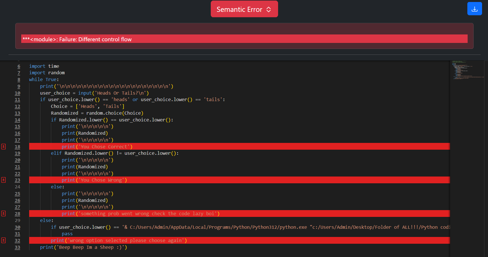
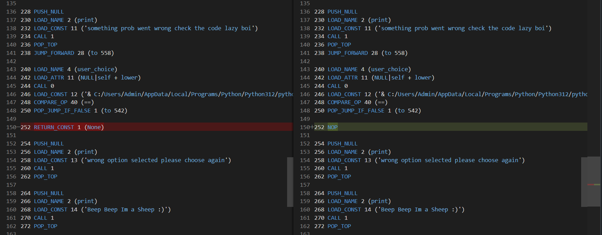
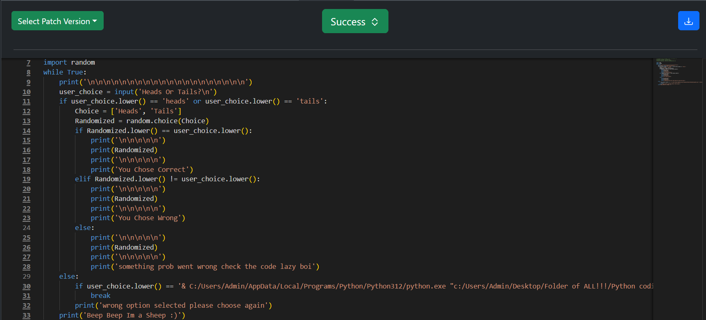

Break/Pass/Continue Confusion
=============================

Original Decompiled Code
-----------------------

Relevant Bytecode Difference
----------------------------

How to fix
----------

In this case, a break statement was incorrectly translated as a pass. When examining the bytecode difference, the issue becomes evident at the line following the if statement:

if user_choice.lower() == '& C:/Users/Admin/AppData/Local/Programs/Python/Python312/python.exe "c:/Users/Admin/Desktop/Folder of ALL!!!/Python coding stuff/cointoss.py"':

Since the entire program is inside a while True loop, the RETURN_CONST 1 (None) indicates that we should be exiting the loop—and thus the program—if the condition is met.
Otherwise, the execution should jump to the offset after this line.

Patched Output
--------------

