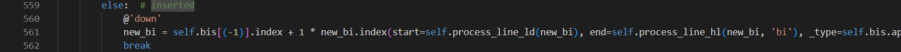

Decorators
==========

Original Decompiled Code
-----------------------

How to fix
----------

In some cases,the model might mistakenly add decorators before non-function or non-class elements, such as variables or expressions. 

When you encounter this, simply delete or comment out the decorator for the time being. Once you have the bytecode difference, you can attempt to fix the semantic error that may or may not occur.
