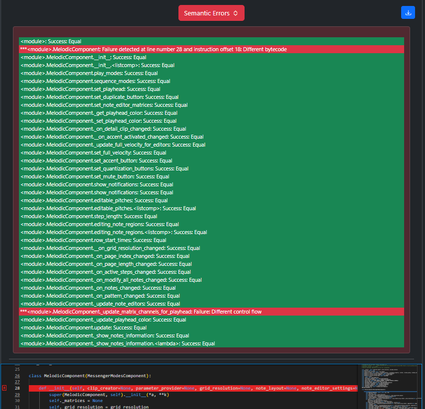
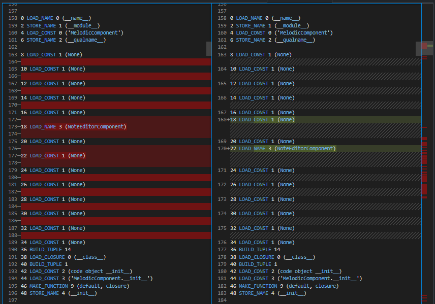
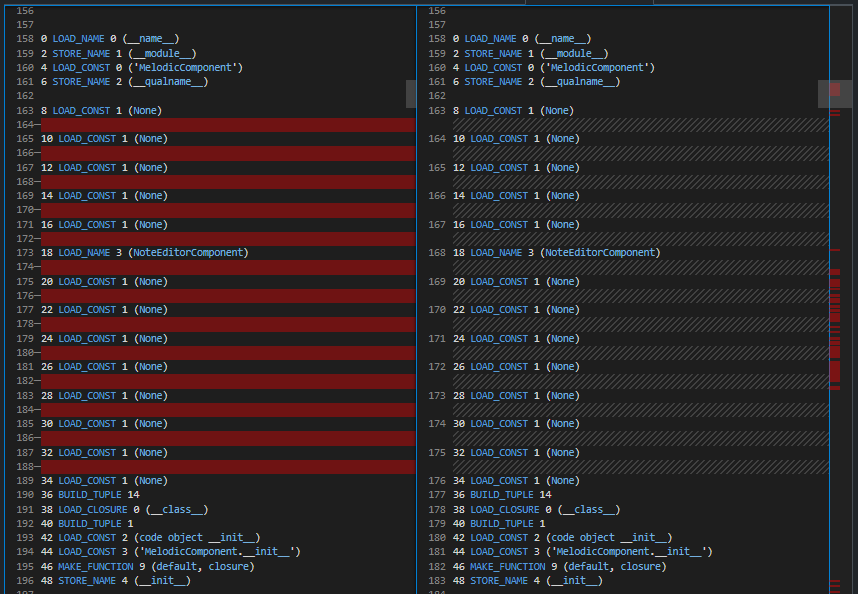

Function Call Order Mismatch
============================

Original Decompiled Code
-----------------------

.. code-block:: python

    def __init__(self, clip_creator=None, parameter_provider=None, grid_resolution=None, note_layout=None, note_editor_settings=None, note_editor_class=None, velocity_range_thresholds=NoteEditorComponent, skin=None, instrument_play_layer=None, instrument_sequence_layer=None, pitch_mod_touch_strip_mode=None, play_loop_instrument_layer=None, layer=None, sequence_layer_with_loop=None, *a, **k):

Relevant Bytecode Difference
----------------------------

How to fix
----------

You can refer to the Bytecode Difference to see where there is an error on the order of function call. The fix is to simply adjust the order of the function call so the Bytecode Difference will match.

Patched Output
--------------

.. code-block:: python

    def __init__(self, clip_creator=None, parameter_provider=None, grid_resolution=None, note_layout=None, note_editor_settings=None, note_editor_class=NoteEditorComponent, velocity_range_thresholds=None, skin=None, instrument_play_layer=None, instrument_sequence_layer=None, pitch_mod_touch_strip_mode=None, play_loop_instrument_layer=None, layer=None, sequence_layer_with_loop=None, *a, **k):
