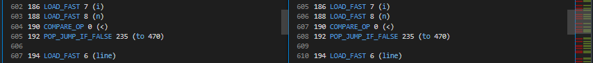
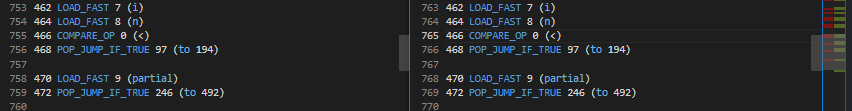

While Check Hallucination
=========================

Relevant Bytecode Difference
----------------------------

Check before the loop content

Check after the loop content

Explanation
-----------

This issue is only found in Python 3.10 and it isn't even really an issue. This tutorial is really to let users know that this is a false flag and to ignore, since it will fix itself as you fix other control flow error.

This "hallucination" occurs because Python 3.10 checks for while loop conditions in 2 distinct location in bytecode.

From the above snapshots, you can see that the "check before the loop content" jumps to the code outside of the while loop while the "check after the loop content" jumps to the code at the start of while loop.