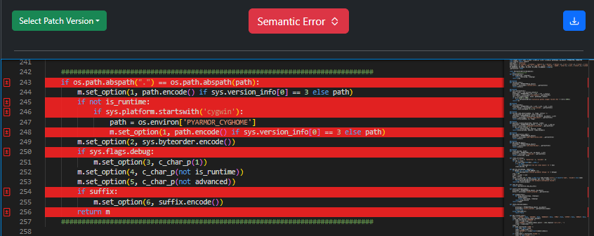
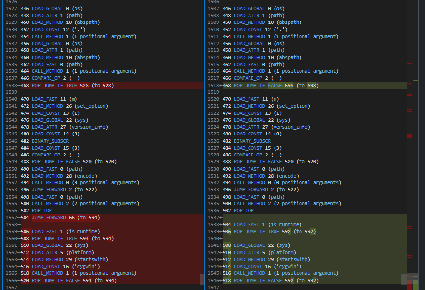
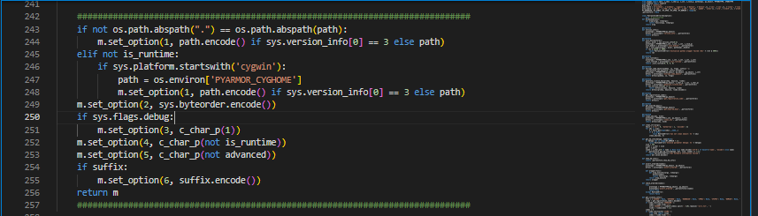

If Elif Confusion
=================

Original Decompiled Code
-----------------------

Relevant Bytecode Difference
----------------------------

How to fix
----------

A good sign that that consecutive if statements are supposed to be elif statements are JUMP_FORWARD or JUMP_ABSOLUTE following the content of the if statements in the bytecode.

Patched Output
--------------

