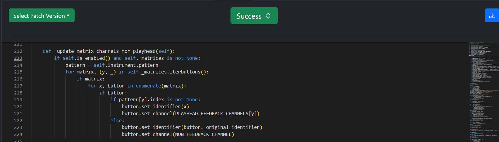

If Segmentation Issue
=====================

Original Decompiled Code
-----------------------

.. image:: images/if-segmentation/segOriginal.png

Relevant Bytecode Difference
----------------------------

.. image:: images/if-segmentation/segBytecodeDiff.png

How to fix
----------

The issue lies in the jump target for POP_JUMP_IF_FALSE when checking the button condition. In the provided .pyc file, if the condition is false, the code correctly jumps back to the start of the for x, ... loop. However, in the decompiled code, it incorrectly jumps to the lines where the button's identifier and channel are set.

The .pyc bytecode indicates that the button condition should be its own if statement, with the following if condition nested inside it.

The bytecode difference shows that the button condition needs to be in its own if block, with the next if condition nested within it. The else block should correspond only to this inner condition.

Patched Output
--------------

