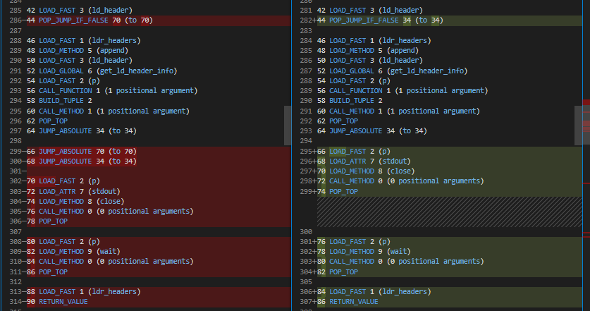

Missing or Empty Else Block
===========================

Original Decompiled Code
-----------------------

.. code-block:: python

    while True:
        ld_header = get_ld_header(p)
        if ld_header:
            ldr_headers.append((ld_header, get_ld_header_info(p)))
    p.stdout.close()
    p.wait()
    return ldr_headers

Relevant Bytecode Difference
----------------------------

How to fix
----------

In general, JUMP_ABSOLUTE on the Bytecode Diff is a good indicator that else block is the cause of the issue.

In the above case, the Decomipled Bytecode is missing 2 JUMP_ABSOLUTEs. Using this and the context around the code, preceeding if statement, you can deduce that the first JUMP_ABSOLUTE is for an else block and the second JUMP_ABSOLUTE is for a break statement.

Patched Output
--------------

.. code-block:: python

    while True:
        ld_header = get_ld_header(p)
        if ld_header:
            ldr_headers.append((ld_header, get_ld_header_info(p)))
        else:
            break
    p.stdout.close()
    p.wait()
    return ldr_headers