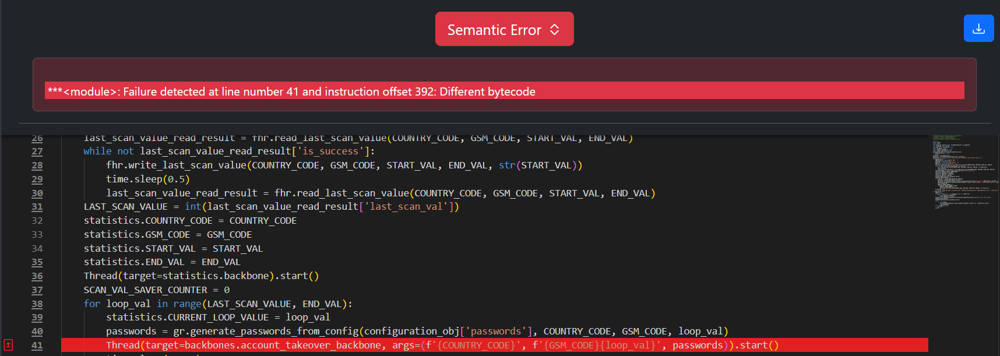
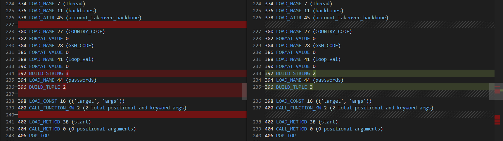
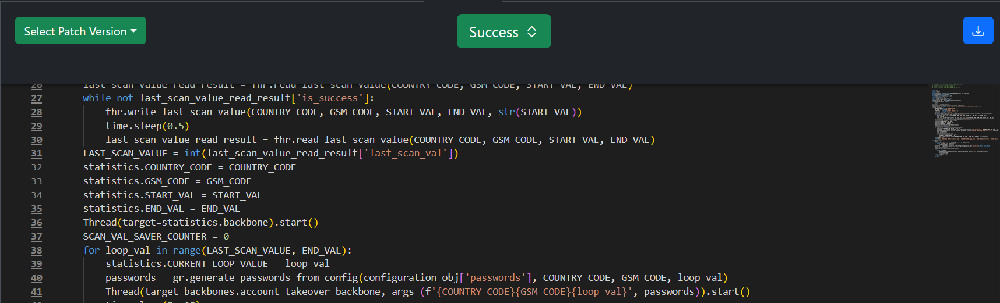

Incorrect Statement
====================

Original Decompiled Code
-----------------------

Relevant Bytecode Difference
----------------------------

How to fix
----------

The issue occurs in the way the string formatting and tuple construction are handled in the args argument passed to the Thread function. The expected behavior is that all three values—COUNTRY_CODE, GSM_CODE + loop_val, and passwords—are combined correctly into a string and a tuple. 
However, the original decompiled code incorrectly handles the order of this process.

The issue is shown in the Bytecode difference, which incorrectly combines only two values into the string using BUILD_STRING 2, and then forms a tuple with three elements using BUILD_TUPLE 3. 
However, the correct behavior should be to combine all three values into the string using BUILD_STRING 3, and then form a tuple with just two elements using BUILD_TUPLE 2.

Patched Output
--------------

