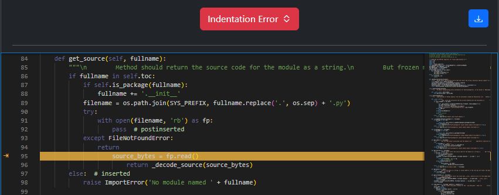
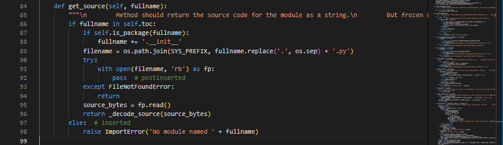

Wrong Indentation
=================

Original Decompiled Code
-----------------------

How to fix
----------

Indentation errors in Python occur when the code is not properly aligned according to Python’s indentation rules. This is important since Python uses indentation to define the structure and hierarchy of code blocks.

To fix this, you should observe the code around the flagged line.

For the above case you can see that line 95 and 96 are indented too deep after a blank return statement. Since line 93 and 94 are except block and the blank return statement(line 94) ends the except block, you can deduce that line 95 and 96 are part of the if block that starts on line 86.

Patched Output
--------------

