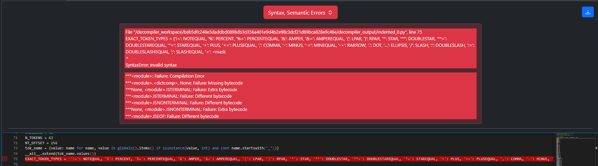
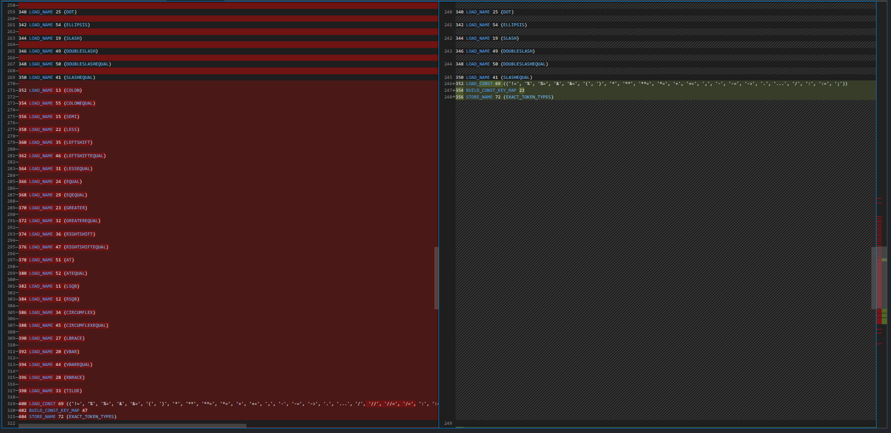
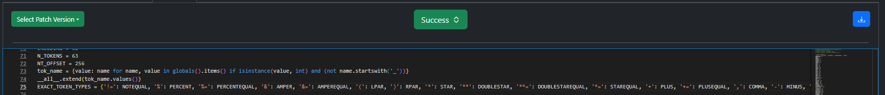

Long Dictionary
===============

Original Decompiled Code
-----------------------

.. code-block:: python

    EXACT_TOKEN_TYPES = {'!=': NOTEQUAL, '%': PERCENT, '%=': PERCENTEQUAL, '&': AMPER, '&=': AMPEREQUAL, '(': LPAR, ')': RPAR, '*': STAR, '**': DOUBLESTAR, '**=': DOUBLESTAREQUAL, '*=': STAREQUAL, '+': PLUS, '+=': PLUSEQUAL, ',': COMMA, '-': MINUS, '-=': MINEQUAL, '->': RARROW, '.': DOT, '...': ELLIPSIS, '/': SLASH, ':': DOUBLESLASH, ':=': DOUBLESLASHEQUAL, ';': SLASHEQUAL, '<': <mask

Relevant Bytecode Difference
----------------------------

How to fix
----------

It's evident from the Bytecode Difference snapshot that there is are list entries missing from the dictionary and it ends prematurely.

You can easily fix long dictinary error by checking the bytecode diff for missing items and their matching keys to recreate a correct and complete dictinary.

Patched Output
--------------

.. code-block:: python

    EXACT_TOKEN_TYPES = {'!=': NOTEQUAL, '%': PERCENT, '%=': PERCENTEQUAL, '&': AMPER, '&=': AMPEREQUAL, '(': LPAR, ')': RPAR, '*': STAR, '**': DOUBLESTAR, '**=': DOUBLESTAREQUAL, '*=': STAREQUAL, '+': PLUS, '+=': PLUSEQUAL, ',': COMMA, '-': MINUS, '-=': MINEQUAL, '->': RARROW, '.': DOT, '...': ELLIPSIS, '/': SLASH, '//': DOUBLESLASH, '//=': DOUBLESLASHEQUAL, '/=': SLASHEQUAL, ':': COLON, ':=': COLONEQUAL, ';': SEMI, '<': LESS, '<<': LEFTSHIFT, '<<=': LEFTSHIFTEQUAL, '<=': LESSEQUAL, '=': EQUAL, '==': EQEQUAL, '>': GREATER, '>=': GREATEREQUAL, '>>': RIGHTSHIFT, '>>=':RIGHTSHIFTEQUAL, '@': AT, '@=': ATEQUAL, '[': LSQB, ']': RSQB, '^': CIRCUMFLEX, '^=': CIRCUMFLEXEQUAL, '{': LBRACE, '|': VBAR, '|=': VBAREQUAL, '}': RBRACE, '~': TILDE}
