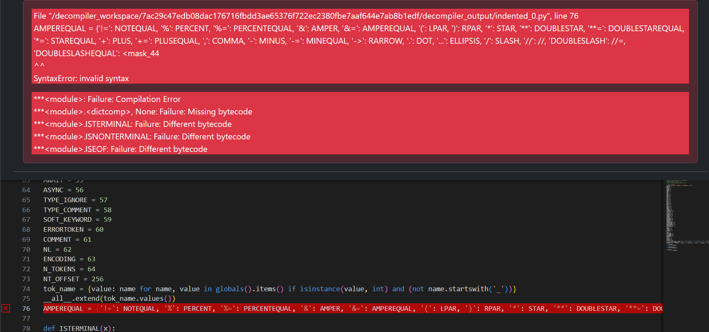

Mismatched Parentheses
======================

Original Decompiled Code
-----------------------

How to fix
----------

When dealing with long statements, commonly with large dictionaries, the Python decompiler model might leave some parentheses, brackets, or curly braces unclosed. 
There might even be some non python elements at the end, like <mask334>.

The best approach in these cases is to manually close any unclosed parentheses, brackets, or braces. 
If you encounter a dictionary with an unresolved key value, you can temporarily insert a placeholder value until you can use the bytecode difference to determine the correct value.
