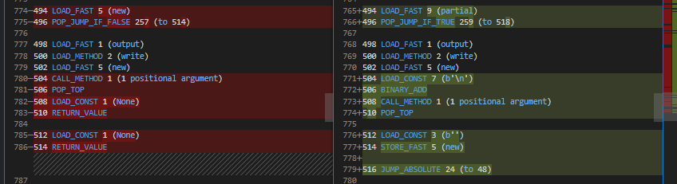

Return Statement
================

Original Decompiled Code
-----------------------

.. code-block:: python

    def decode(input, output, header=False):
        ...
        while True:
            ...
        if new:
            output.write(new)
            return
        return

Relevant Bytecode Difference
----------------------------

How to fix
----------

Most of the problems you encounter with return statement will be one of 3 cases: missing return statement, wrong indentation for return statement, or wrong return value.

For all 3 cases, you start buy identifying the rturn statement in the Bytecode Diff. Refer to the snapshot above. You can tell return statement is needed if you find a LOAD_CONST followed by a RETURN_VALUE.

For this specific case, the issue is missing return statement. You can see from the snap shot that there are 2 return statements in a row. Using this and by refering to the jump targets, you can conclude that a return statement is needed inside the if statement and at the end of the function.

You can use the jump targets to determine the correct place of return statement in case of wrong indentation.

And you can refer to the value in the LOAD_CONST to fix the wrong return value. For example, if the bytecode shows "LOAD_COST (True)   RETURN_VALUE", then "return True" is the correct return statement to use.

Patched Output
--------------

.. code-block:: python

    def decode(input, output, header=False):
        ...
        while True:
            ...
        if new:
            output.write(new)
