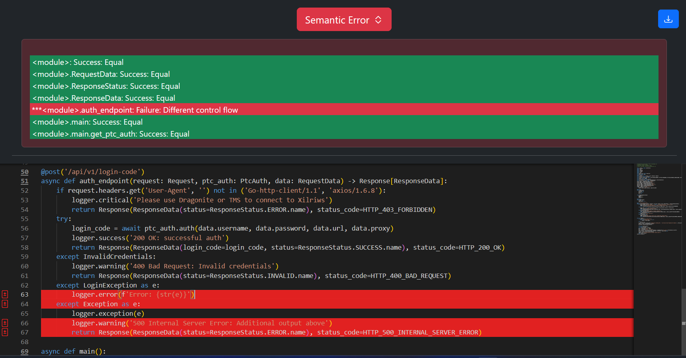

Try-Except
==========

Original Decompiled Code
-----------------------

Relevant Bytecode Difference
----------------------------

.. image:: images/try-except/bytecodep1.png
.. image:: images/try-except/bytecodep2.png

How to fix
----------

The first and most important thing to notice is the different jump targets for JUMP_FORWARD, JUMP_IF_NOT_EXC_MATCH, and SETUP_FINALLY in the bytecode. JUMP_FORWARD skips over remaining except blocks to continue execution after handling an exception. JUMP_IF_NOT_EXC_MATCH checks if the current exception matches a specific type and jumps if it doesn't, ensuring proper exception handling flow. SETUP_FINALLY sets up a finally block to guarantee cleanup code runs, regardless of how the try block exits. The produced output jumps to the end of the function(offset 300), when it should be jumping to the statement at offset 266/268 while breaking out of the try-except block, that being:

logger.warning('500 Internal Server Error: Additional output above')

and then executing the next line

return Response(ResponseData(status=ResponseStatus.ERROR.name), status_code=HTTP_500_INTERNAL_SERVER_ERROR)

resulting in a succesful patch.

Patched Output
--------------

