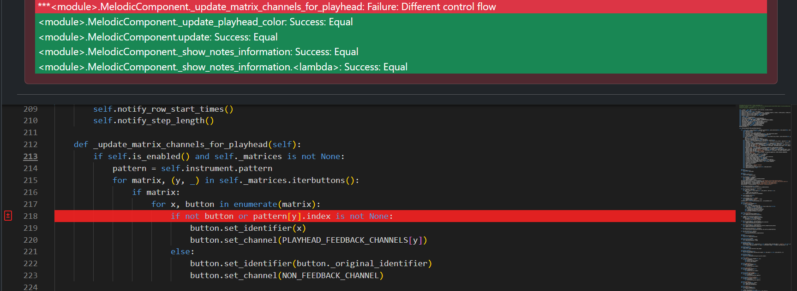
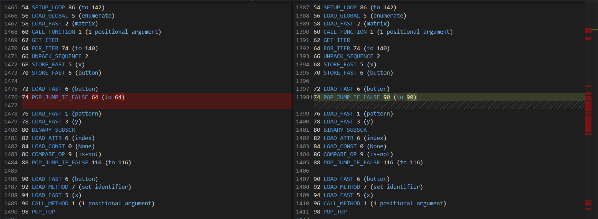
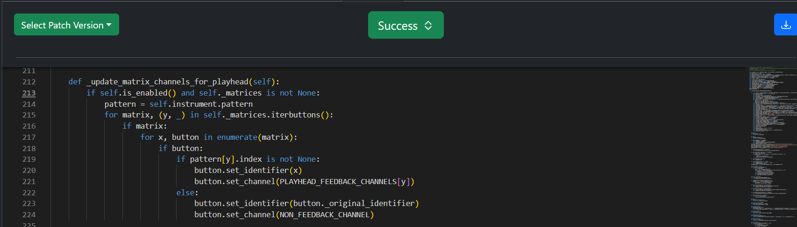

If Segmentation Issue
=====================

Original Decompiled Code
-----------------------

Relevant Bytecode Difference
----------------------------

How to fix
----------

The issue in this case is how the decompiler handled the condition in the original code. It incorrectly combines two conditions using an or operator.

The POP_JUMP_IF_FALSE instruction checks if button is false or if pattern[y].index is not None. 
If either condition is true, the program jumps to the block where the button's identifier and channel are set. However, this logic can cause incorrect behavior when button is false.

The bytecode difference reveals that the button condition should be in its own if block, with the next if condition nested inside it. The else block should only correspond to this inner condition.

Patched Output
--------------

