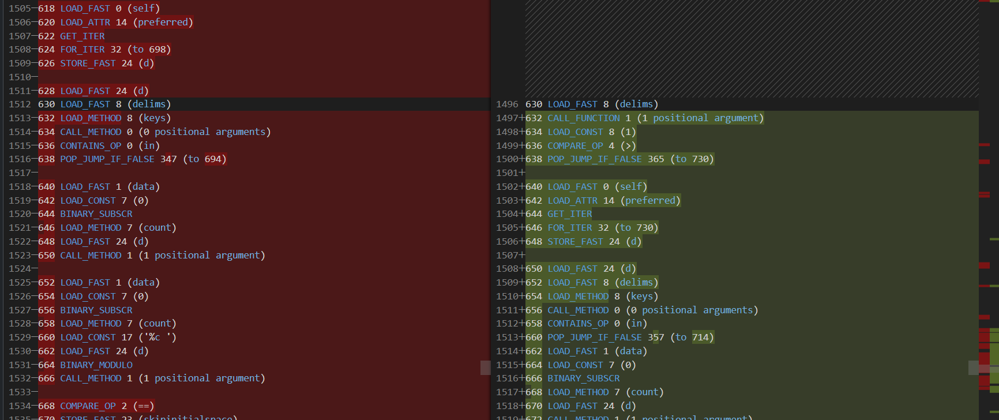
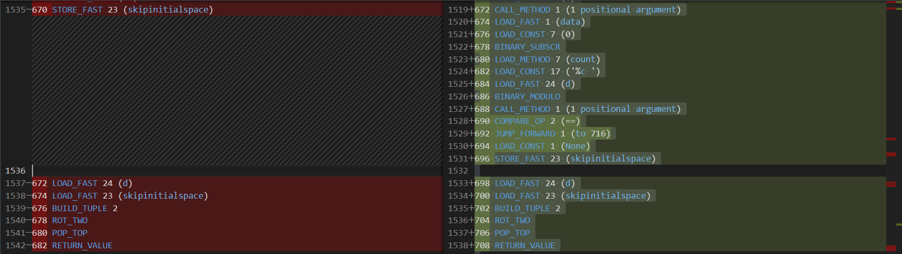
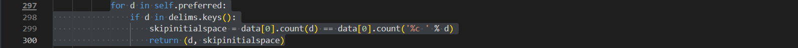

Incorrect Boolean Expression
============================

Original Decompiled Code
-----------------------

Relevant Bytecode Difference
----------------------------

How to fix
----------

The bytecode from the original decompiled code mishandles the boolean condition by trying to implement a ternary operator (if d in delims.keys() else None), leading to unnecessary jumps (JUMP_FORWARD) and 
incorrect assignments of None to skipinitialspace. This disrupts the flow, causing premature returns or skipped logic, whereas the patched code uses a proper if statement with POP_JUMP_IF_FALSE 
to ensure the conditional block is only executed when the condition(d in delims.keys():) is true.

Patched Output
--------------

